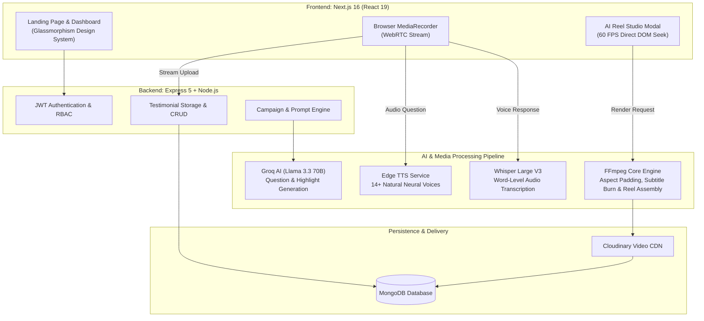

<p align="center">
  
  
  
  
  
</p>

<h1 align="center">🎬 Feedspace AI</h1>

<h3 align="center">
  <em>Enterprise Autonomous Video Testimonial & Viral Reel Platform</em>
</h3>

<p align="center">
  Feedspace replaces manual customer review collection with an autonomous AI voice interviewer, smart 30s–60s viral reel clipping, karaoke subtitle burning, and an embeddable Wall of Love — wrapped in a frosted Glassmorphism UI.
</p>

<p align="center">
  <a href="#-quick-start"><b>Quick Start</b></a> •
  <a href="#-architecture--ai-pipeline"><b>Architecture</b></a> •
  <a href="#-key-features"><b>Features</b></a> •
  <a href="#-api-reference"><b>API Docs</b></a> •
  <a href="#-glassmorphism-design-system"><b>Design System</b></a> •
  <a href="#-enterprise-seo"><b>SEO Engine</b></a> •
  <a href="#-deployment"><b>Deployment</b></a>
</p>

---

## ⚡ Live Demo Credentials

Test the platform instantly without manual signup:

| Parameter | Value |
| :--- | :--- |
| **Frontend URL** | [http://localhost:3000](http://localhost:3000) |
| **Backend API** | [http://localhost:5000/api](http://localhost:5000/api) |
| **Demo Email** | `testuser@example.com` |
| **Demo Password** | `password123` |
| **Quick Login** | Click **"⚡ 1-Click Demo Login"** on `/login` |

---

## 🌟 What is Feedspace?

Traditional testimonial collection is slow, awkward, and produces raw footage unsuitable for social marketing. **Feedspace** automates the entire lifecycle:

1. **🎯 Dynamic AI Campaigns**: Generates tailor-made interview questions using **Groq LLaMA 3.3 70B** based on your product's value proposition.
2. **🎙️ Voice AI Interviewer**: Conducts live browser-based customer interviews using **Microsoft Edge TTS** and real-time **Whisper Large V3** transcription.
3. **⏱️ Single 30s–60s Viral Reel Standard**: Instead of confusing multi-clip fragments, Feedspace isolates the highest-impact **30s to 60s customer story** and formats it into a vertical (9:16) reel.
4. **✨ Hardware-Accelerated Studio**: Browser studio with **60 FPS zero-lag scrubbing**, word-by-word karaoke subtitle highlighting, and fast server FFmpeg compilation.
5. **💎 Glassmorphism Design System**: Optical frosted obsidian glass cards, specular highlights, and chromatic ambient refraction orbs.
6. **🌟 Universal Wall of Love & Embeds**: Generates embeddable iframe snippets and standalone customer insight widgets for any website.

---

## 🏗️ Architecture & AI Pipeline



---

## ✨ Key Features

| Capability | Technical Implementation |
| :--- | :--- |
| **🧠 Autonomous Voice Interviewer** | Groq Llama 3.3 70B generates adaptive follow-up questions in real time. |
| **🎙️ Zero-Cost Neural TTS** | Microsoft Edge TTS provides 14+ voices across 7 languages without per-minute fees. |
| **📝 Word-Level Transcription** | Groq Whisper Large V3 generates timestamped subtitles with punctuation and sentiment tags. |
| **⏱️ 30s–60s Single Story Engine** | Universal FFmpeg pipeline creates cohesive, lag-free 45-second vertical reels (`1080x1920`). |
| **⚡ 60 FPS Lag-Free Playback** | Bypasses React state overhead via `useRef` direct DOM updates for instantaneous seeking. |
| **💎 Optical Glassmorphism UI** | Multi-layer frosted obsidian cards (`backdrop-filter: blur(28px)`), specular bevels, and cyan/purple/pink refraction orbs. |
| **🔍 Enterprise SEO Architecture** | Dynamic `/sitemap.xml`, `/robots.txt`, OpenGraph/Twitter cards, and Schema.org JSON-LD structured data. |
| **🌟 Embed Widget & Wall of Love** | 1-Click embed code generator for WordPress, Webflow, Shopify, or React. |

---

## 🛠 Tech Stack

### Frontend Client
- **Framework**: Next.js 16.1.6 (React 19.2.3, Turbopack)
- **Styling**: Tailwind CSS 4 + Custom Glassmorphism Token Engine
- **Typography**: Google Fonts `Outfit` (display) & `Inter` (body)
- **Media Engine**: Native MediaRecorder API & HTML5 Video Ref synchronization
- **Icons & Visuals**: Micro-dot SVG Mesh & dynamic aspect ratio simulator

### Backend API Server
- **Runtime**: Node.js 18+
- **Server Framework**: Express 5.2.1
- **Database**: MongoDB (Mongoose 9.2.1)
- **Authentication**: JWT (`jsonwebtoken 9.0.3`) & `bcryptjs`
- **Video Processing**: FFmpeg (`fluent-ffmpeg 2.1.3`) with universal aspect auto-padding
- **AI Services**: Groq SDK (`groq-sdk`), Edge TTS (`edge-tts`), OpenAI API

---

## ⚡ Quick Start

### 1. Prerequisites
- **Node.js**: v18.0.0 or higher
- **MongoDB**: Local MongoDB (`mongodb://localhost:27017`) or MongoDB Atlas
- **FFmpeg**: Installed and configured in system `PATH` (or specified in `FFMPEG_PATH`)

### 2. Clone & Install

```bash
# Clone the repository
git clone https://github.com/your-org/feedspace.git
cd feedspace

# Install Backend Dependencies
cd backend
npm install

# Install Frontend Dependencies
cd ../frontend
npm install
```

### 3. Configure Environment Variables

**Backend Configuration (`backend/.env`):**
```env
PORT=5000
MONGO_URI=mongodb://localhost:27017/htt_hackbits
JWT_SECRET=super_secret_feedspace_jwt_key_2026
JWT_EXPIRE=30d
JWT_COOKIE_EXPIRE=30

# Groq AI Engine (Llama 3.3 70B & Whisper)
GROQ_API_KEY=gsk_your_groq_api_key_here
GROQ_AI_MODEL=llama-3.3-70b-versatile
GROQ_HIGHLIGHT_MODEL=llama-3.3-70b-versatile

# Cloudinary Storage (Optional for cloud CDN)
CLOUDINARY_CLOUD_NAME=your_cloud_name
CLOUDINARY_API_KEY=your_api_key
CLOUDINARY_API_SECRET=your_api_secret

# FFmpeg Executable Path (if not globally in PATH)
# FFMPEG_PATH=C:\ffmpeg\bin\ffmpeg.exe
```

**Frontend Configuration (`frontend/.env`):**
```env
NEXT_PUBLIC_API_URL=http://localhost:5000/api
NEXT_PUBLIC_SITE_URL=http://localhost:3000
```

### 4. Launch Application

```bash
# Terminal 1: Backend Server (runs on http://localhost:5000)
cd backend
npm run dev

# Terminal 2: Frontend Client (runs on http://localhost:3000)
cd frontend
npm run dev
```

Open [http://localhost:3000](http://localhost:3000) in your browser.

---

## 📡 API Reference

Base URL: `http://localhost:5000/api`

### 🔐 Authentication
| Method | Endpoint | Description | Access |
| :--- | :--- | :--- | :--- |
| `POST` | `/auth/register` | Register new organization account | Public |
| `POST` | `/auth/login` | Authenticate and receive JWT token | Public |
| `GET` | `/auth/me` | Fetch authenticated user profile | 🔒 Bearer Token |

### 🎯 Campaigns & Projects
| Method | Endpoint | Description | Access |
| :--- | :--- | :--- | :--- |
| `GET` | `/projects` | Retrieve all campaigns for user | 🔒 Bearer Token |
| `POST` | `/projects` | Create new campaign with custom prompt | 🔒 Bearer Token |
| `GET` | `/projects/:id` | Get details for specific campaign | 🔒 Bearer Token |
| `DELETE` | `/projects/:id` | Remove campaign and associated assets | 🔒 Bearer Token |
| `GET` | `/projects/public/:id` | Public campaign metadata for recording page | Public |
| `POST` | `/campaigns/questions` | AI-generate interview questions via LLaMA | Public |

### 🎥 Testimonials & Video Engine
| Method | Endpoint | Description | Access |
| :--- | :--- | :--- | :--- |
| `GET` | `/testimonials/campaign/:id` | Retrieve testimonials for campaign | 🔒 Bearer Token |
| `GET` | `/testimonials/:id/insights` | Get AI sentiment & trust scores | Public |
| `POST` | `/video/upload` | Upload raw customer video recording | Public |
| `POST` | `/reel-studio/render` | Trigger FFmpeg custom 9:16 reel compilation | 🔒 Bearer Token |

### 🎙️ Voice & AI Intelligence
| Method | Endpoint | Description | Access |
| :--- | :--- | :--- | :--- |
| `POST` | `/voice/tts` | Synthesize question to speech (Edge TTS) | Public |
| `POST` | `/voice/stt` | Transcribe customer audio (Whisper V3) | Public |
| `GET` | `/voice/voices` | Enumerate available neural voices | Public |

---

## 💎 Glassmorphism Design System

Feedspace implements an **Optical Glassmorphism** design language. Each surface simulates optical physical glass through high-density blur, specular top-edge refraction highlights, and chromatic back-lighting:

```css
/* Core Frosted Glass Surface */
.glass-morphism {
  background: rgba(15, 23, 42, 0.60);
  backdrop-filter: blur(28px) saturate(190%);
  -webkit-backdrop-filter: blur(28px) saturate(190%);
  border: 1px solid rgba(255, 255, 255, 0.12);
  box-shadow: 
    0 20px 50px -12px rgba(0, 0, 0, 0.7),
    inset 0 1px 1px 0 rgba(255, 255, 255, 0.16);
}
```

- **Refraction Orbs**: Chromatic cyan, purple, and neon pink radial orbs sit behind glass panels in `src/app/layout.js`, ensuring all frosted cards refract vibrant colors.
- **Micro-interactions**: Subtle hover elevation (`-2px`), glowing border shifts, and smooth button scales.

---

## 🔍 Enterprise SEO Engine

- **Next.js App Router Metadata**: Configured with OpenGraph, Twitter cards, viewport meta, and canonical link generation.
- **Dynamic Sitemap (`/sitemap.xml`)**: Automatically served via `sitemap.js`.
- **Crawler Rules (`/robots.txt`)**: Dynamically served via `robots.js`.
- **Schema.org Structured Data**:
  - `SoftwareApplication` (Category: MultimediaApplication, 4.9/5 Rating, Feature list)
  - `Organization` (Feedspace AI branding, socials)
  - `FAQPage` (Landing page rich snippets for Google search)

---

## 🚀 Production Deployment

### Docker Deployment
```dockerfile
# Build frontend and backend images
docker compose up --build -d
```

### Production Checklist
- [x] Configure production `MONGO_URI` (MongoDB Atlas with replica sets).
- [x] Set strong, unique `JWT_SECRET`.
- [x] Configure Cloudinary credentials for permanent asset CDN hosting.
- [x] Verify FFmpeg binary installed on host container.
- [x] Set `NEXT_PUBLIC_API_URL` to your production API domain.

---

## 📄 License

This project is licensed under the **MIT License**. See `LICENSE` for details.
